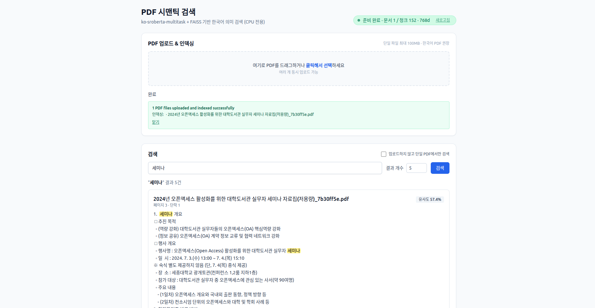

# PDF 시맨틱 검색 시스템

한국어 PDF에 대해 의미 기반(semantic) 검색을 제공하는 풀스택 애플리케이션입니다.
`ko-sroberta-multitask` 임베딩과 FAISS 벡터 인덱스를 사용하며, CPU 전용으로 최적화되어 있어 GPU 없이도 동작합니다.



---

## 주요 기능

- **PDF 텍스트 추출** — PyMuPDF로 한글 CID/임베디드 폰트까지 정확히 추출, 단락 단위 청크 분할
- **한국어 문장 임베딩** — `jhgan/ko-sroberta-multitask` (mean pooling + L2 정규화)
- **코사인 유사도 검색** — FAISS `IndexFlatIP` (정규화 벡터의 내적 = 코사인 유사도)
- **누적 인덱싱** — 업로드된 PDF가 기존 인덱스에 추가되어 영구 보존
- **단일 파일 임시 검색** — 인덱스에 추가하지 않고 업로드한 PDF에서만 검색
- **웹 UI** — Vue 3 SPA (드래그 앤 드롭 업로드, 진행률, 유사도/하이라이트)
- **REST API** — FastAPI 기반, Swagger UI(`/docs`) 자동 제공
- **CPU 최적화** — `torch.set_num_threads(<=4)`, 배치 임베딩, lifespan warm-up

---

## 기술 스택

| 영역 | 사용 기술 |
|---|---|
| Backend | FastAPI · uvicorn · PyMuPDF · transformers · torch · faiss-cpu · pandas (parquet) |
| Frontend | Vue 3 · TypeScript · Vite · TailwindCSS · axios · vue-router |
| 모델 | `jhgan/ko-sroberta-multitask` (Sentence-Transformers 호환) |
| 인덱스 | FAISS `IndexFlatIP` (float32) + Parquet 메타 |

---

## 시스템 요구사항

- Python 3.10+ (3.8 이상 동작 가능)
- Node.js 18+ (프론트엔드 빌드)
- 최소 4GB RAM (8GB 이상 권장)
- PDF 크기·수에 맞는 디스크 공간

---

## 프로젝트 구조

```
semantic_pdf_search/
├── backend/                    FastAPI 서버
│   ├── main.py                 진입점 · CORS · SPA 마운트 · lifespan warm-up
│   ├── config.py               경로 / 모델 / 배치 상수
│   ├── requirements.txt
│   ├── models/
│   │   ├── embedding.py        EmbeddingModel (싱글톤, CPU)
│   │   └── faiss_index.py      FAISSIndex (싱글톤, IndexFlatIP)
│   ├── services/
│   │   ├── pdf_service.py      PDF 추출 / 저장 / 임시 처리
│   │   └── search_service.py   인덱싱·검색 흐름 조립
│   ├── routers/
│   │   ├── upload.py           /upload/*
│   │   └── search.py           /search/*
│   └── data/
│       ├── pdfs/               업로드된 원본 PDF
│       └── index/              pdf_index.faiss · pdf_chunks.parquet · pdf_metadata.parquet
├── frontend/                   Vue 3 SPA
│   └── src/
│       ├── views/              HomeView
│       ├── components/         UploadZone · SearchPanel · ResultList · ResultItem · StatusBadge
│       ├── composables/        useUpload · useSearch
│       ├── api/                client (axios) · upload · search
│       ├── types/              백엔드 응답 스키마
│       └── router/             Vue Router (hash 모드)
├── docs/
│   ├── architecture.md         아키텍처 문서
│   └── uml.md                  Mermaid UML 다이어그램
├── Makefile                    install · dev · build · clean
└── README.md
```

---

## 설치

```bash
# 1. 백엔드 의존성
pip install -r backend/requirements.txt

# 2. 프론트엔드 의존성
make install                    # 내부적으로 cd frontend && npm ci
```

> 가상환경(`python -m venv venv && source venv/bin/activate`) 사용을 권장합니다.

---

## 실행

### 개발 모드 (백엔드 + 프론트엔드 dev 서버 동시 실행)

```bash
make dev
```

- 백엔드: `http://localhost:8000` (uvicorn `RELOAD=1`)
- 프론트엔드: `http://localhost:5173` (Vite)
- Vite proxy로 `/api/*` 호출이 백엔드(:8000)로 포워딩 → CORS 신경 X
- 한쪽이 종료되면 다른 쪽도 함께 종료됨

### 운영 모드 (단일 origin, FastAPI가 SPA 정적 호스팅)

```bash
make build                      # frontend/dist 생성
cd backend && python main.py    # FastAPI가 dist를 / 에 자동 마운트
```

브라우저에서 `http://localhost:8000` 접속.

### 개별 실행

```bash
make backend-dev                # 백엔드만 (RELOAD=1)
make frontend-dev               # 프론트엔드만
make clean                      # dist / __pycache__ / Vite 캐시 제거
```

---

## API 엔드포인트

Swagger UI: `http://localhost:8000/docs`

### PDF 업로드 & 인덱싱

```
POST /upload/pdf/
```
- `files`: PDF 파일 (멀티파트, 다중 업로드 가능)
- 단일 파일 최대 100MB
- 기존 인덱스에 누적 추가됨

### 인덱싱된 코퍼스 검색

```
GET /search/?query=<검색어>&top_k=<개수>
```
- `query` (required) · `top_k` (기본 5, 최대 50)

### 단일 PDF 임시 검색 (인덱싱 안 함)

```
POST /search/file/
```
- `file` · `query` · `top_k` (multipart form)

### 인덱스 상태 조회

```
GET /search/status/
```
응답 예:
```json
{
  "status": "ready",
  "indexed_documents": 4,
  "indexed_chunks": 1273,
  "vector_dimension": 768
}
```

---

## 환경 변수

| 변수 | 기본값 | 설명 |
|---|---|---|
| `RELOAD` | `0` | `1`/`true` 시 uvicorn 자동 리로드 (개발용) |
| `ALLOWED_ORIGINS` | `*` | CORS 화이트리스트(쉼표 구분). 운영에서는 좁히는 것을 권장 |
| `FRONTEND_DIST` | `{repo}/frontend/dist` | SPA 정적 파일 디렉토리 경로 |

---

## 성능 / 메모리 튜닝

`backend/config.py`에서 조정:

- `torch.set_num_threads(min(cpu_count, 4))` — CPU 스레드 수
- `EMBEDDING_BATCH_SIZE = 8` — 메모리 부족 시 낮추고, 여유 있으면 16~32로 올려 처리량 향상
- `MAX_LENGTH = 512` — 토큰 최대 길이
- `MAX_UPLOAD_BYTES = 100 * 1024 * 1024` — 단일 파일 업로드 상한 (100MB)

---

## 문서

- [아키텍처](docs/architecture.md) — 계층 구조, 모듈 책임, 데이터 흐름, 영속성, 주요 설계 결정, 배포 토폴로지
- [UML](docs/uml.md) — 컴포넌트 / 클래스 / 시퀀스 / 상태머신 / 배포 다이어그램 (Mermaid)

---

## 알려진 이슈와 해결 방법

1. **메모리 부족** — `EMBEDDING_BATCH_SIZE` 감소, PDF 청크 길이 임계값(`pdf_service.py`의 `len(para) < 20`) 조정
2. **느린 처리 속도** — CPU 코어 수에 맞춰 `torch.set_num_threads()` 증가, 대용량 PDF 사전 분할
3. **첫 요청 지연** — `main.py`의 `lifespan` warm-up이 모델 cold start를 startup으로 이동시킴 (이미 적용)
4. **uvicorn reload 무한 루프** — `app.log` / `data/*`가 watcher에서 제외됨 (이미 적용)
5. **`pytorch_model.bin` 로드 차단(CVE-2025-32434)** — `use_safetensors=True`로 안전 로드 (이미 적용)

---

## 라이선스

MIT License — [LICENSE](LICENSE) 참고
