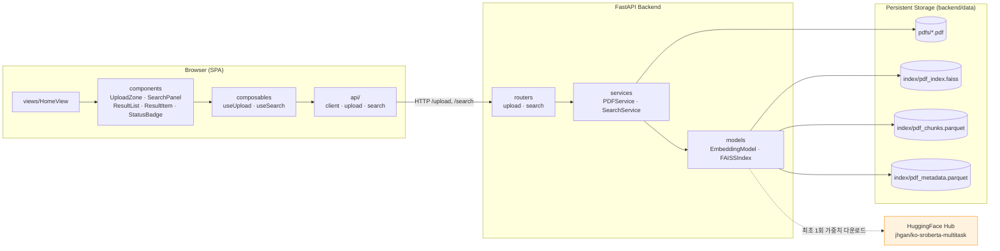
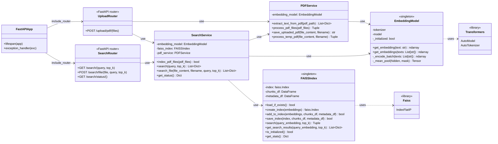
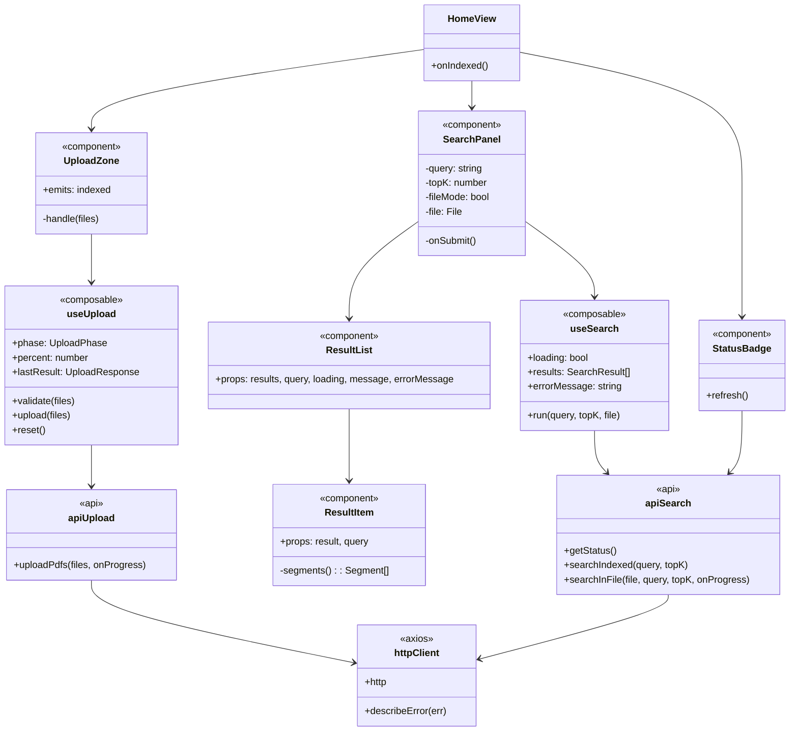
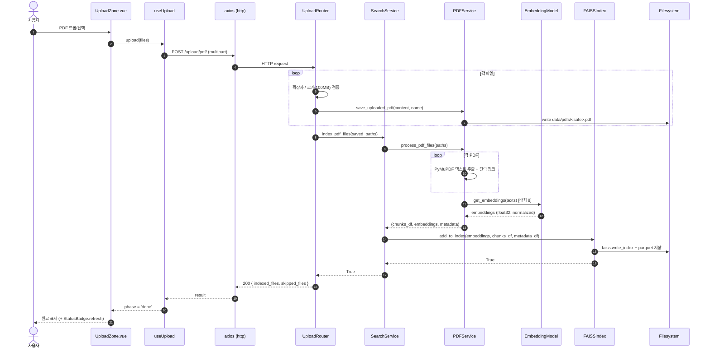
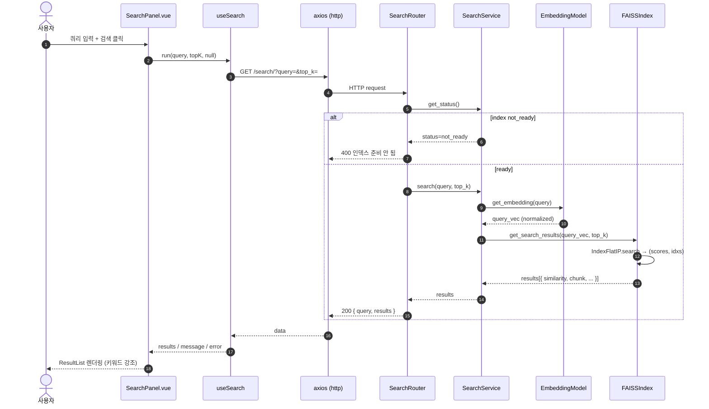
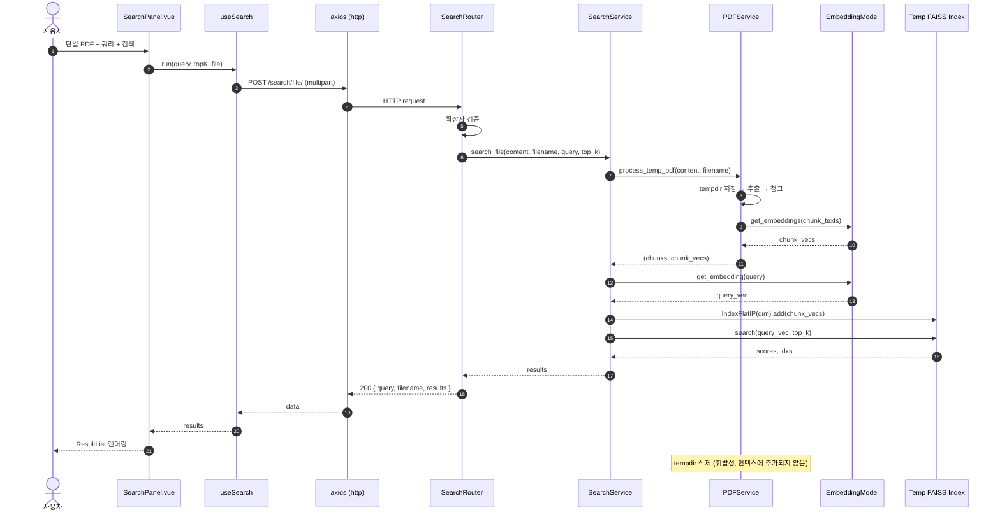
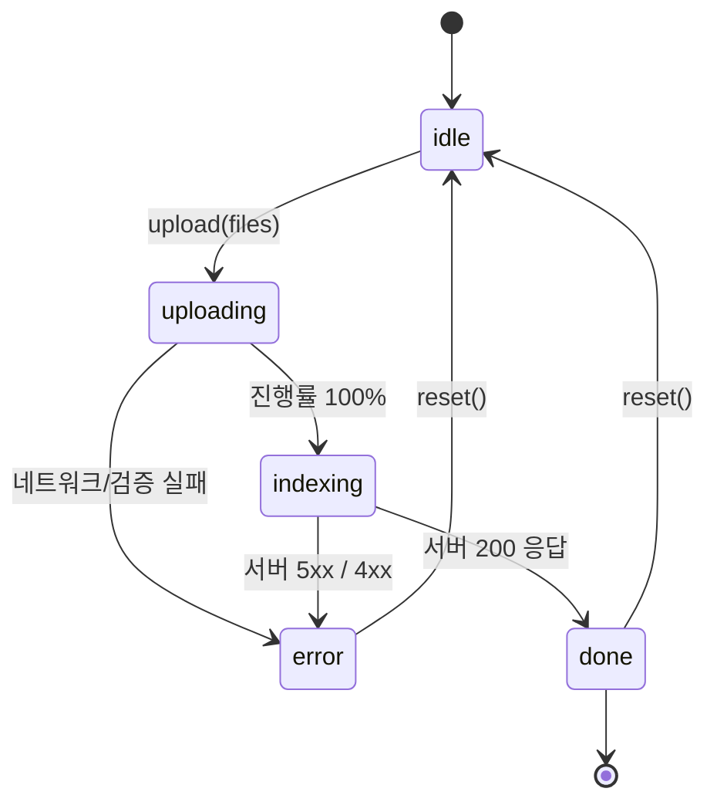
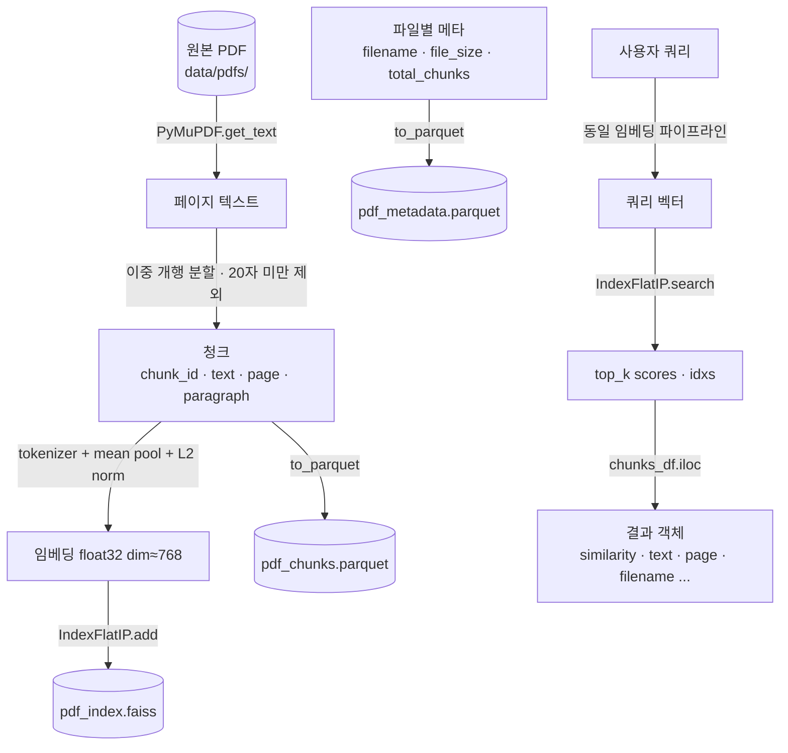
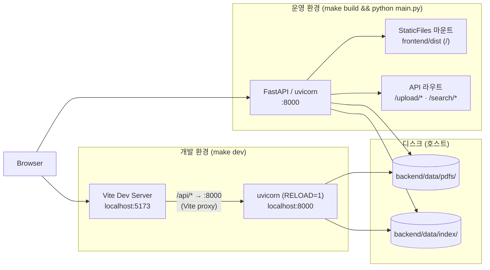

# UML 다이어그램

본 문서는 `semantic_pdf_search`의 구조와 동작을 Mermaid 기반 UML로 시각화합니다.
모든 다이어그램은 GitHub Mermaid 렌더링과 호환됩니다.

목차
1. [컴포넌트 다이어그램](#1-컴포넌트-다이어그램-component-diagram)
2. [백엔드 클래스 다이어그램](#2-백엔드-클래스-다이어그램-class-diagram)
3. [프론트엔드 모듈 다이어그램](#3-프론트엔드-모듈-다이어그램)
4. [업로드 & 인덱싱 시퀀스](#4-업로드--인덱싱-시퀀스-sequence-diagram)
5. [코퍼스 검색 시퀀스](#5-코퍼스-검색-시퀀스-sequence-diagram)
6. [단일 파일 임시 검색 시퀀스](#6-단일-파일-임시-검색-시퀀스-sequence-diagram)
7. [업로드 상태머신](#7-업로드-상태머신-state-diagram)
8. [데이터 흐름](#8-데이터-흐름-data-flow)
9. [배포 다이어그램](#9-배포-다이어그램-deployment-diagram)

---

## 1. 컴포넌트 다이어그램 (Component Diagram)

---

## 2. 백엔드 클래스 다이어그램 (Class Diagram)

---

## 3. 프론트엔드 모듈 다이어그램

---

## 4. 업로드 & 인덱싱 시퀀스 (Sequence Diagram)

---

## 5. 코퍼스 검색 시퀀스 (Sequence Diagram)

---

## 6. 단일 파일 임시 검색 시퀀스 (Sequence Diagram)

---

## 7. 업로드 상태머신 (State Diagram)

`useUpload`의 `phase` 변수가 따르는 상태 전이입니다.

---

## 8. 데이터 흐름 (Data Flow)

---

## 9. 배포 다이어그램 (Deployment Diagram)

