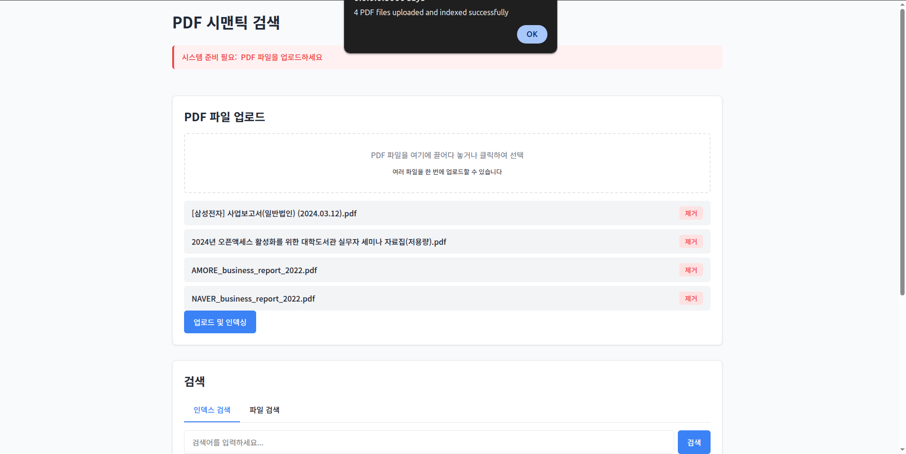

# PDF 시맨틱 검색 시스템

ko-sroberta-multitask 임베딩 모델과 FAISS를 사용한 한국어 PDF 시맨틱 검색 시스템입니다. CPU 전용으로 최적화되어 있어 GPU가 없는 환경에서도 효율적으로 실행할 수 있습니다.




## 주요 기능

- **PDF 텍스트 추출**: PDF 파일에서 텍스트를 추출하고 의미 있는 청크로 분할
- **한국어 텍스트 임베딩**: ko-sroberta-multitask 모델을 사용한 한국어 텍스트 임베딩 생성
- **코사인 유사도 검색**: FAISS 벡터 데이터베이스를 이용한 빠른 유사도 검색
- **웹 인터페이스**: 사용자 친화적인 웹 인터페이스를 통한 PDF 업로드 및 검색
- **REST API**: FastAPI 기반의 RESTful API 제공
- **CPU 최적화**: 메모리 및 CPU 사용 최적화로 GPU 없이도 효율적인 실행

## 시스템 요구사항

- Python 3.8 이상
- 최소 4GB RAM (8GB 이상 권장)
- PDF 크기와 수에 따라 충분한 디스크 공간

## 설치 방법

1. 저장소 클론 또는 다운로드:

```bash
git clone https://github.com/yourusername/semantic_pdf_search.git
cd semantic_pdf_search
```

2. 가상 환경 생성 및 활성화 (선택 사항):

```bash
python -m venv venv
source venv/bin/activate  # Linux/Mac
# 또는
venv\Scripts\activate  # Windows
```

3. 필요한 패키지 설치:

```bash
pip install -r requirements.txt
```

## 실행 방법

1. FastAPI 서버 시작:

```bash
python main.py
```

또는 

```bash
uvicorn main:app --host 0.0.0.0 --port 8000 --reload
```

2. 브라우저에서 접속:

```
http://localhost:8000
```

## 디렉토리 구조

```
semantic_pdf_search/
├── main.py                  # FastAPI 애플리케이션 시작점
├── config.py                # 설정 파일 (CPU 최적화 설정 포함)
├── models/
│   ├── __init__.py
│   ├── embedding.py         # 임베딩 모델 (ko-sroberta-multitask)
│   └── faiss_index.py       # FAISS 인덱스 (코사인 유사도)
├── services/
│   ├── __init__.py
│   ├── pdf_service.py       # PDF 처리 서비스
│   └── search_service.py    # 검색 서비스
├── routers/
│   ├── __init__.py
│   ├── upload.py            # 업로드 API 라우터
│   └── search.py            # 검색 API 라우터
└── static/
    └── index.html           # 웹 인터페이스
```

## API 엔드포인트

### PDF 업로드 및 인덱싱
- **POST** `/upload/pdf/`
  - 여러 PDF 파일을 업로드하고 검색 인덱스에 추가

### 검색
- **GET** `/search/`
  - 인덱싱된 PDF에서 검색
  - 쿼리 파라미터:
    - `query`: 검색어 (필수)
    - `top_k`: 반환할 결과 개수 (기본값: 5)

- **POST** `/search/file/`
  - 특정 PDF 파일에서만 검색 (인덱싱 없이)
  - 폼 데이터:
    - `file`: PDF 파일 (필수)
    - `query`: 검색어 (필수)
    - `top_k`: 반환할 결과 개수 (기본값: 5)

### 상태 확인
- **GET** `/search/status/`
  - 검색 서비스 상태 정보 조회

## 성능 최적화

시스템의 성능을 최적화하기 위해 `config.py` 파일에서 다음 설정을 조정할 수 있습니다:

- `torch.set_num_threads(4)`: CPU 코어 수에 맞게 조정
- `EMBEDDING_BATCH_SIZE`: 메모리 사용량 제어를 위한 배치 크기 조정

## 알려진 이슈와 해결 방법

1. **메모리 부족 오류**: 
   - `config.py`에서 `EMBEDDING_BATCH_SIZE` 값을 낮추어 메모리 사용량 감소
   - 텍스트 청크 크기 조정 (기본값: 20자 이상)

2. **느린 처리 속도**:
   - 가능한 경우 `torch.set_num_threads()` 값을 CPU 코어 수에 맞게 증가
   - PDF 파일 크기 제한 또는 전처리 최적화

## 라이선스

MIT 라이선스

## 사용된 주요 라이브러리

- [FastAPI](https://fastapi.tiangolo.com/): 빠른 API 개발을 위한 웹 프레임워크
- [PyTorch](https://pytorch.org/): 딥러닝 모델을 위한 프레임워크
- [Transformers](https://huggingface.co/docs/transformers/): 자연어 처리 모델 (ko-sroberta-multitask)
- [FAISS](https://github.com/facebookresearch/faiss): 벡터 유사도 검색 라이브러리
- [PyPDF2](https://pypi.org/project/PyPDF2/): PDF 파일 처리 라이브러리
- [Pandas](https://pandas.pydata.org/): 데이터 처리 라이브러리
